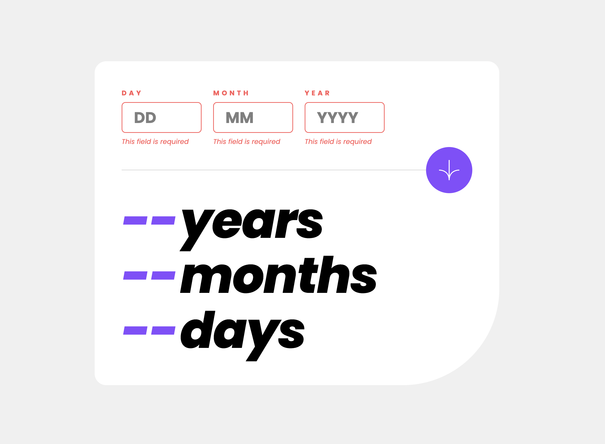

# Age Calculator App

## Table of contents

- [Overview](#overview)
  - [Screenshot](#screenshot)
  - [Links](#links)
- [My process](#my-process)
  - [Built with](#built-with)
- [Author](#author)

## Overview

### Screenshot

### Links

- Solution URL: [Solution URL](https://github.com/kisu-seo/age_calculator_app)
- Live Site URL: [Live URL](https://kisu-seo.github.io/age_calculator_app/)

## My process

### Built with

- **Semantic HTML5 Markup** — Structured the page using `<main>`, `<article>`, `<form>`, `<section>`, `<label>`, `<input type="number">`, and `<button>` elements to reflect the document's meaning and hierarchy. The calculator card is wrapped in `<article>` (a self-contained composition), and the results area uses `<section>` with a descriptive `aria-label`. No `
` is used where a semantic element is more appropriate.

- **WebAccessibility (ARIA)** — Full screen reader support is implemented throughout:
  - `aria-live="polite"` on the results `<section>` announces calculated output to screen readers after the current speech completes, preventing interruption.
  - `role="alert"` + `aria-live="polite"` on each `.error-message` `` triggers immediate announcement the moment an error is injected by JavaScript.
  - `aria-describedby` links each `<input>` to its corresponding error span, so screen readers read the error message as part of the field's context.
  - `aria-invalid="true"` is set dynamically on validation failure and cleared on correction, giving assistive technologies a programmatic signal of field state.
  - `aria-hidden="true"` on the arrow icon image prevents decorative SVG content from being announced.

- **CSS Custom Properties (Design Tokens)** — All design values are declared in `:root` as a single source of truth. Tokens are grouped by concern:
  - **Color**: `--color-white`, `--color-black`, `--color-grey-100/200/500`, `--color-red-400`, `--color-purple-500`
  - **Typography**: `--font-family`
  - **Spacing (8px grid)**: `--spacing-100` (8px) through `--spacing-700` (56px)
  - **Component-specific spacing**: `--divider-margin-mobile/tablet/desktop`, `--results-padding-mobile/tablet/desktop` — extracted from design spec measurements to eliminate hardcoded magic numbers
  - **Component tokens**: `--border-radius-card`, `--border-radius-input`, `--btn-size-mobile`, `--btn-size-tablet`

- **Mobile-First Responsive Design (2 Breakpoints)** — Base styles target mobile. Two `min-width` media queries progressively enhance the layout:
  - **768px (Tablet)**: Card padding expands to 56px, `border-bottom-right-radius` increases to 200px, all typography scales up (Text Preset 6 → 5 for labels, Preset 4 → 3 for inputs, Preset 2 → 1 for results), submit button grows from 64px to 96px.
  - **1024px (Desktop)**: Submit button repositions from horizontal center to the right end of the divider (`left: auto; right: 0`), `input-group` constrains to `max-width: 75%` to reserve space for the right-aligned button, and hover effects are activated.

- **CSS Flexbox** — The primary layout mechanism. `.input-group` uses Flexbox to distribute three input fields (`flex: 1` each) with equal width. `.result-line` uses `align-items: baseline` to visually align the large number and label text by their typographic baselines regardless of size. `.submit-btn` uses Flexbox centering for the icon.

- **Asymmetric Border Radius** — The card's `border-radius` uses four distinct values, setting only the bottom-right corner to a large radius (`100px` on mobile, `200px` on tablet+). This implements the design's signature shape while the other three corners retain the standard `24px` radius.

- **Custom Number Input Styling** — Browser-native number spinners are removed via `::-webkit-outer-spin-button` / `::-webkit-inner-spin-button` (WebKit/Blink) and `-moz-appearance: textfield` (Firefox). Both vendor-prefixed and standard `appearance` properties are declared together to ensure cross-browser compatibility.

- **Desktop-Only Hover State** — The submit button's background-color hover transition is scoped exclusively inside `@media (min-width: 1024px)`. On touch devices (mobile/tablet), the `:hover` pseudo-class is not applied, preventing the "stuck hover" issue where the hover state persists after a tap because touch events do not fire a matching mouseout.

- **State Management Pattern (Vanilla JS)** — A single `state` object acts as the application's source of truth, holding `values` (raw input strings) and `errors` (per-field validation results as `null | string`). All reads and writes go through `state`, establishing a predictable unidirectional data flow: user action → state update → DOM render.

- **Separation of Concerns (Business Logic vs. UI Logic)** — Validation is handled by `getValidationErrors()`, a function that reads `state.values` and returns an errors object **without touching the DOM**. `renderErrors()` reads `state.errors` and updates the DOM. This separation means validation logic can be tested independently and the UI layer is replaceable without modifying business rules.

- **DRY Principle via DOM Element Arrays** — All three input fields (day, month, year) are managed as a structured `fields` array of objects `{ key, field, input, errorSpan }`. A companion `fieldMap` (ES6 `Map`) provides O(1) key-based lookup. Repetitive operations (clearing errors, binding input events, rendering state) are handled with a single `forEach` rather than duplicated per-field code blocks.

- **Count-Up Animation with `requestAnimationFrame`** — The result numbers animate from 0 to their target value using `requestAnimationFrame` instead of `setInterval`. `rAF` synchronizes callbacks with the browser's display refresh cycle (typically 60fps), eliminating intermediate frames that `setInterval` would fire between paints. An **ease-out cubic** interpolation (`1 - (1-t)^3`) is applied so the count decelerates as it approaches the target, producing a visually natural deceleration effect. The animation also auto-pauses when the tab is inactive, conserving CPU.

- **Calendar Date Validation (Edge Case: Leap Year & Month-end)** — The JavaScript `Date` constructor's overflow behavior is exploited to validate day-month-year combinations: `new Date(year, month - 1, day)` automatically rolls over to the next month when the day exceeds the actual month length (e.g., April 31 → May 1). By comparing the resulting `getFullYear()`, `getMonth()`, and `getDate()` against the original inputs, invalid dates are detected without a lookup table, and leap year logic is handled implicitly by the runtime.

- **Local Poppins Font via `@font-face`** — Six Poppins variants (Regular 400, Italic 400i, Bold 700, Bold Italic 700i, ExtraBold 800, ExtraBold Italic 800i) are served from local `.ttf` files. This eliminates external network requests to Google Fonts, avoids third-party GDPR exposure of user IPs, and guarantees font availability regardless of CDN connectivity. `font-display: swap` prevents FOIT (Flash of Invisible Text) by rendering a fallback system font until Poppins is ready.

- **JSDoc Documentation** — All JavaScript functions are annotated with JSDoc block comments (`/** ... */`) specifying `@description`, `@param` (with TypeScript-style type annotations), and `@returns`. Complex functions additionally document architectural rationale (e.g., why Early Return is avoided in `getValidationErrors()`, why `performance.now()` is used over `Date.now()` in `animateCount()`). This enables IDE IntelliSense hover hints and serves as inline API documentation for future contributors.

## Author

- Website - [Kisu Seo](https://github.com/kisu-seo)
- Frontend Mentor - [@kisu-seo](https://www.frontendmentor.io/profile/kisu-seo)
